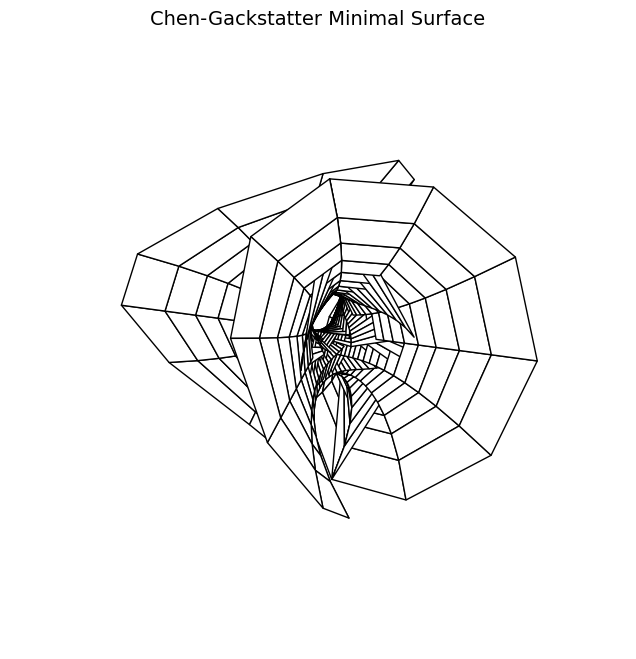

# Minimal Surface Visualization Web App

A web application for visualizing Chen-Gackstatter minimal surfaces using Weierstrass elliptic functions.



## Description

This web application allows users to generate and visualize mathematical minimal surfaces. Users can customize parameters such as resolution and color mapping through a simple web interface.

## Features

- Interactive web interface for generating minimal surfaces
- Customizable resolution and color mapping
- High-quality 3D visualizations
- Based on rigorous mathematical implementations using Weierstrass elliptic functions

## Installation

Clone the repository:

```console
git clone https://github.com/yourusername/minimal-surface.git
cd minimal-surface
```

Install the required dependencies:

```console
pip install -r requirements.txt
```

## Running Locally

To run the application locally:

```console
python application.py
```

Then open your web browser and navigate to `http://localhost:5000`.

## Deploying to AWS Elastic Beanstalk

1. Install the EB CLI:

2. Initialize your EB CLI repository:

```console
eb init -p python-3.8 minimal-surface --region us-east-1
```

3. Create an environment and deploy:

```console
eb create minimal-surface-env
```

4. Open the deployed application:

```console
eb open
```

## Usage

1. Select the surface type from the dropdown menu
2. Adjust the resolution using the slider
3. Choose a color map (or leave as default)
4. Click "Generate Surface" to create the visualization

## Mathematical Background

The Chen-Gackstatter surface is a complete minimal surface of finite total curvature with genus 1 and 3 embedded flat ends. It can be viewed as a generalization of Enneper's surface with a handle.

The implementation uses Weierstrass elliptic functions to compute the surface coordinates based on the parametrization:

- X = Re(π·z - ζ(z) - π/g₂·℘'(z))
- Y = Im(π·z + ζ(z) - π/g₂·℘'(z))
- Z = √(6π/g₂)·Re(℘(z))

where ℘(z) is the Weierstrass p-function, ℘'(z) its derivative, and ζ(z) is the Weierstrass zeta function.

## License

MIT

## Author

Christoph Gackstatter