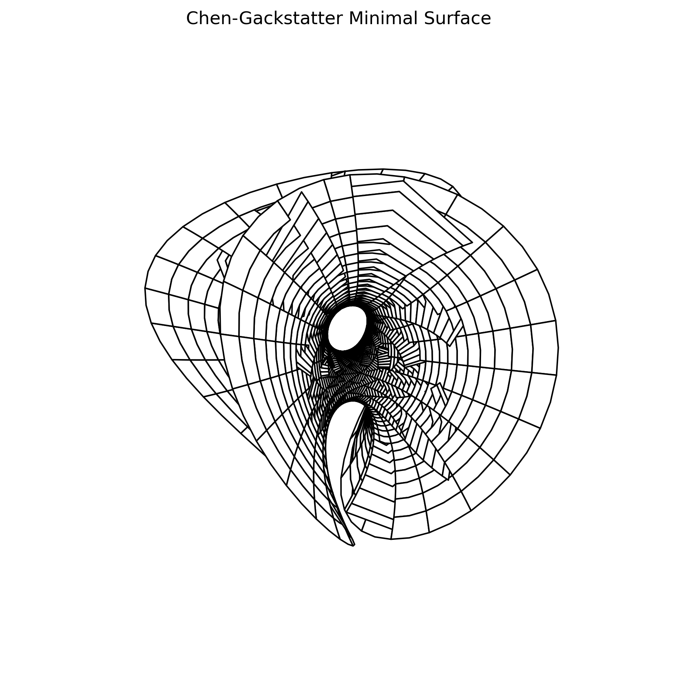

# Minimal Surface Visualization

This project provides tools for calculating and visualizing Chen-Gackstatter minimal surfaces using Weierstrass elliptic functions.



## Installation

Clone the repository and install the package:

```console
git clone https://github.com/cfgackstatter/minimal-surface.git
cd minimal-surface
pip install -e .
```

## Usage

### Generate a Surface Image

The simplest way to use this package is to run the provided script:

```console
python scripts/generate_surface.py
```

This will generate a PNG image of the Chen-Gackstatter minimal surface.

### Use in Your Own Code

You can also use the package in your Python code:

```python
import numpy as np
import matplotlib.pyplot as plt
from minimal_surface.surfaces import chen_gackstatter_surface
from minimal_surface.visualization import plot_surface
```

#### Create a grid of points in polar coordinates

```python
r = np.linspace(1/5, 4/5, 100)
theta = np.linspace(-np.pi, np.pi, 100)
r, theta = np.meshgrid(r, theta)
```

#### Generate the surface

```python
X, Y, Z = chen_gackstatter_surface(r, theta)
```

#### Visualize the surface

fig, ax = plot_surface(X, Y, Z, title="My Minimal Surface")
plt.show()

## Customization

You can customize the visualization by passing additional parameters to the `plot_surface` function:

```python
plot_surface(
X, Y, Z,
title="Custom Minimal Surface",
save_path="my_surface.png",
view_angles=(30, -45) # (elevation, azimuth)
)
```

## Contributing

Contributions are welcome! Please feel free to submit a Pull Request.